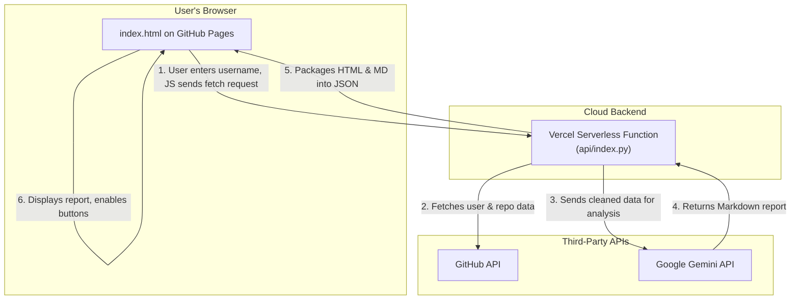

# Profile-Pilot ✈️


**An AI-powered web application that generates a comprehensive, human-readable analysis of any GitHub user's profile.**

This tool is designed for recruiters, hiring managers, and team leads to quickly understand a developer's skills, focus areas, and project highlights without manually digging through their entire profile.


### [**➡️ View Live Demo**](https://profile-pilot-seven.vercel.app/)

---

## About The Project

GitHub profiles are dense with information. Profile-Pilot acts as an intelligent co-pilot, using a Large Language Model (Google's Gemini) to synthesize a developer's public data into an insightful, structured report. It saves time and helps uncover key details that might otherwise be missed.

### ✨ Features

*   **AI-Powered Analysis:** Generates a report with four key sections:
    *   📊 **Overall Summary:** A concise paragraph on the developer's likely expertise.
    *   💻 **Key Technical Skills:** An inferred list of skills based on repository data.
    *   🚀 **Notable Projects:** A summary of the user's most interesting repositories.
    *   🧑‍💻 **Developer Archetype:** A fun but insightful persona assignment.
*   **Simple Web Interface:** A clean, easy-to-use interface for entering a username and viewing the report.
*   **User-Friendly Tools:**
    *   📋 **Copy to Clipboard:** Easily copy the full Markdown report.
    *   ⬇️ **Download as Markdown:** Save the report as a `.md` file for offline use.
*   **Responsive Design:** Works smoothly on both desktop and mobile devices.

## 🛠️ Technology Stack & Skills Demonstrated

This project was built using a modern, serverless architecture and demonstrates proficiency across the full stack.

**Frontend:**
*   HTML5
*   CSS3
*   Vanilla JavaScript (ES6+) for DOM manipulation and API calls (`fetch`).

**Backend (Serverless Function):**
*   **Python 3**
*   **Google Gemini API:** For all generative AI capabilities.
*   **GitHub API:** For fetching user and repository data.
*   Libraries: `google-generativeai`, `requests`, `markdown2`.

**Cloud & DevOps:**
*   **Vercel:** Hosting for the Python serverless backend function.
*   **GitHub Pages:** Hosting for the static frontend web application.
*   **Git & GitHub:** Version control and repository management.
*   **Environment Variables:** Secure management of API keys on Vercel.

**Core Concepts Showcased:**
*   **Full-Stack Development:** Connecting a frontend user interface to a backend service.
*   **Serverless Architecture:** Building an efficient, on-demand backend without managing traditional servers.
*   **API Integration:** Interacting with multiple third-party APIs (GitHub & Google AI).
*   **Prompt Engineering:** Designing sophisticated, structured prompts to guide the LLM into producing a reliable and well-formatted output.
*   **Defensive Programming:** Implementing robust error handling and data validation on both the frontend and backend.

## 🏛️ Architecture

This application uses a decoupled frontend/backend architecture, where each part is hosted on a platform best suited for its role. The data flows as follows:



### How It Works

1.  The user visits the GitHub Pages site and enters a target username.
2.  The frontend JavaScript sends a `fetch` request to the backend API hosted on Vercel.
3.  The Python serverless function on Vercel receives the request, calls the GitHub API to get the user's profile and repository data, and cleans it.
4.  The cleaned data is then sent to the Google Gemini API with a carefully engineered prompt.
5.  The AI returns a report in Markdown format. The Python function converts this to HTML and packages both formats into a single JSON object.
6.  The frontend JavaScript receives the JSON object, displays the HTML report, and enables the "Copy" and "Download" buttons using the raw Markdown data.

## 🚀 Local Development Setup

To run this project on your local machine:

1.  **Clone the repository:**
    ```bash
    git clone https://github.com/Ziqian-Huang0607/profile-pilot.git
    cd profile-pilot
    ```

2.  **Set up the Backend:**
    *   You need to have Python 3 and Node.js (for `npm`) installed.
    *   Install the Vercel CLI: `npm i -g vercel`
    *   Navigate to the API directory: `cd api`
    *   Create and activate a virtual environment:
        ```bash
        python -m venv venv
        source venv/bin/activate  # On Windows, use `venv\Scripts\activate`
        ```
    *   Install Python dependencies: `pip install -r requirements.txt`
    *   Go back to the root directory: `cd ..`

3.  **Configure Environment Variables:**
    *   Create a file named `.env` in the root directory. **This file should NOT be committed to git.**
    *   Add your secret keys to this file:
        ```
        GOOGLE_API_KEY="your_google_ai_key_here"
        GITHUB_TOKEN="your_github_personal_access_token_here"
        ```

4.  **Run the Development Server:**
    *   Use the Vercel CLI to run both the frontend and backend simultaneously:
        ```bash
        vercel dev
        ```
    *   Open your browser to the URL provided by the CLI (usually `http://localhost:3000`).

## License

This project is licensed under the MIT License. See the `LICENSE` file for details.


## Contribution

This project was built to serve the community, if you have any ideas and improvements you can submit a PR or a issue! I would love to hear from the community! Thanks!
